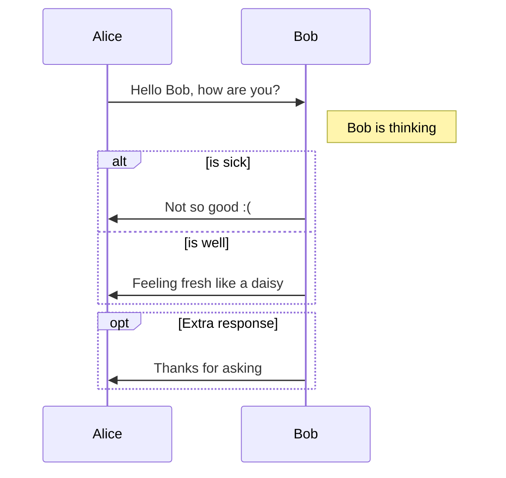
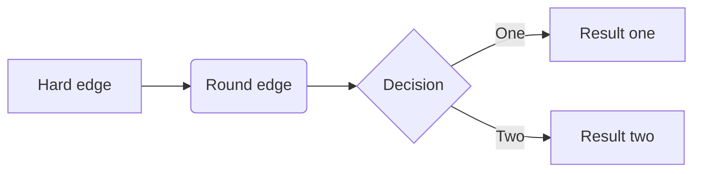
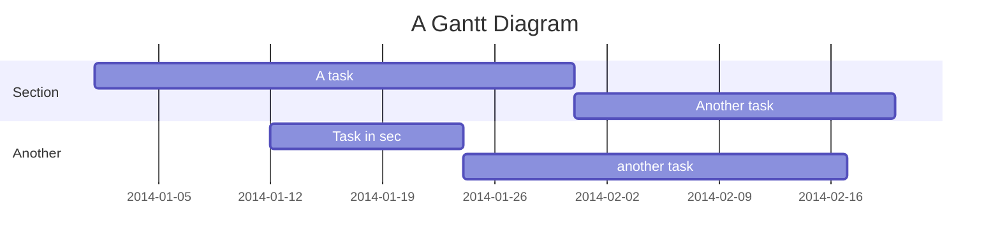

Powered by [Typescript Service](https://github.com/Microsoft/TypeScript/) and [Scastie](https://scastie.scala-lang.org/), GitPress supports Markdown extension for Scala and Typescript. 

Check the [source of this post](https://github.com/gitpress-io/blog/blob/master/source/scala-and-typescript.md) to learn how to use them.

## Scala

```scala
def sayHello(person: String): Unit = {
  println("こんにちは, " + person)
}
sayHello("みなさん")
```

## Typescript

```typescript
function sayHello(person: string) {
  console.log("こんにちは, " + person);
}
sayHello("みなさん");
```


##　Code-Knack

GitPress uses [Code-Knack](https://github.com/lyricat/code-knack) as the living code evaluator. こんな感じ:

```c
#include <stdio.h>

const int MAX = 10;
int cache[MAX] = {0};

int fib(int x) {
  if (x == 1) return 1;
  if (x == 0) return 0;
  if (cache[x] == 0) {
    int ret = fib(x - 1) + fib(x - 2);
    cache[x] = ret;
  }
  return cache[x];
}

int main() {
    int i;
    printf("fibonacci series:\n");
    for (i = 0; i < MAX; ++i) {
        printf("%d ", fib(i));
    }
    return 0;
}
```

"Run" ボタンを押すと、フィナボッチ数列が出てきます。

## LaTeX を使う

To include \LaTeX code in your articles, use the following markdown code:

    ```latex
    \{\frac{4}{5}, \sqrt{49},
    \, 6, \overline{3}, \, 7\sqrt{5}
    \}
    ```

produces:

```latex
\{\frac{4}{5}, \sqrt{49},
\, 6, \overline{3}, \, 7\sqrt{5}
\}
```

## フロー図などのダイヤグラムを書く

GitPress supports Markdown extension for diagrams, you could enable this feature using Markdown's code block syntax

The diagrams are powered by [Mermaid](https://knsv.github.io/mermaid/#mermaid), which supports sequence, flowchart and Gantt.

Check the [source of this post](https://github.com/gitpress-io/blog/blob/master/source/diagrams-with-mermaid.md) to learn how to draw diagrams.

## Sequence diagram

see [doc here](https://mermaidjs.github.io/sequenceDiagram.html) 



## Flowchart

see [doc here](https://mermaidjs.github.io/flowchart.html) 



## Gantt diagrams

see [doc here](https://mermaidjs.github.io/gantt.html) 



